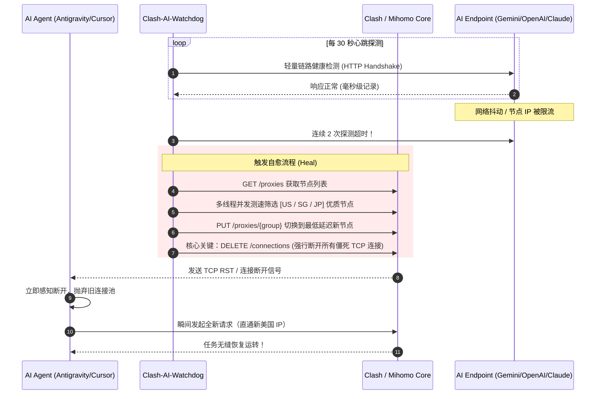

# 🐕 Clash-AI-Watchdog

> **专为 AI Agent / LLM 开发者打造的智能代理健康守护与自动换线自愈引擎**  
> *Zero Token Consumption · Zero External Dependencies · Instant Zombie Connection Teardown*

[](https://www.python.org/)
[](LICENSE)
[](requirements.txt)
[]()

[English](#english-documentation) | [中文说明](#中文说明)

---

<a name="中文说明"></a>
## 💡 为什么需要 Clash-AI-Watchdog？

在使用 **Antigravity**、**Cursor**、**Claude Code**、**OpenCode**、**Aider** 等自主 AI Agent 跑长时间任务（如通宵批量写代码、大规模数据分析、自动化小说生成）时，你是否经常遇到这种绝望场景：

- 💤 **任务无声假死**：控制台一直卡在“正在思考”或“正在等待响应”，一卡就是 10~20 分钟；
- 🔄 **Clash 节点漂移**：代理客户端的 `url-test`（自动选路）在网络轻微抖动时频繁切节点，导致原有的长连接断开；
- 💀 **TCP 僵尸半开连接（Half-Open Socket）**：客户端底层的 HTTP/2 或 gRPC 连接池并不知道网络已断，依然在傻等回复。即使你手动在 Clash 里换了节点，旧连接依然处于挂死状态！

**Clash-AI-Watchdog** 就是为了彻底终结这个痛点而生。

---

## ⚡ 核心自愈机制与工作原理



### 为什么这比 Clash 自带的 `url-test` 强得多？
1. **定向探测 AI 服务**：Clash 自带测速只测百度或 Google 204，而本工具专门探测 `generativelanguage.googleapis.com`、`api.openai.com` 或 `api.anthropic.com`。
2. **强行斩断僵尸连接（杀招）**：单纯切节点**无法唤醒已挂死的 TCP 连接**。Watchdog 会在换线后调用 `DELETE /connections`，逼迫客户端立刻报错并毫秒级重试，从而彻底实现**无人值守自愈**。
3. **0 Token 消耗，0 成本**：仅做网络层握手探测，**绝不调用任何 LLM 生成接口，不消耗哪怕 1 个 Token**。

---

## 🚀 快速上手 (Quick Start)

### 1. 环境准备
- 操作系统：Windows / macOS / Linux
- Python 3.7+（仅使用内置标准库，**无需 pip install 任何依赖！**）
- 运行中的 Clash 客户端（**Clash Verge**, **Clash Verge Rev**, **Mihomo Party**, **Clash Nyanpasu**, **Clash for Windows** 等均可，确保启用了 External Controller 控制端）。

### 2. 下载与运行

#### Windows 用户：
```bash
# 1. 克隆或下载本项目
git clone https://github.com/your-username/clash-ai-watchdog.git
cd clash-ai-watchdog

# 2. 直接双击 run.bat，或在命令行运行：
python main.py
```

#### macOS / Linux 用户：
```bash
git clone https://github.com/your-username/clash-ai-watchdog.git
cd clash-ai-watchdog
chmod +x run.sh
./run.sh
```

---

## 🛠️ 常用命令行参数

```bash
# 执行单次网络诊断与节点测速评估（不进入循环常驻）
python main.py --test

# 指定监控目标服务（默认 gemini，可选 claude, openai, google_204）
python main.py --service claude

# 指定首选区域列表（按顺序探测切换）
python main.py --region US,SG,JP

# 指定心跳频率（默认 30 秒）
python main.py --interval 20

# 在当前目录下生成自定义配置文件 config.json
python main.py --gen-config
```

---

## ⚙️ 配置文件说明 (`config.json`)

运行 `python main.py --gen-config` 即可生成如下默认配置：

```json
{
    "clash_api_base": "auto",            // Clash API 地址，设为 "auto" 将自动扫描发现
    "clash_secret": "",                  // Clash Controller 密钥（若有）
    "mixed_proxy": "auto",               // 本地代理端口，"auto" 自动从 Clash 配置获取

    "target_service": "gemini",          // 探测目标: gemini / claude / openai / google_204
    "check_interval": 30,                // 心跳探测间隔（秒）
    "check_timeout": 8,                  // 探测超时阈值（秒）
    "max_fail_count": 2,                 // 连续失败几次后触发切线自愈

    "preferred_regions": ["US"],         // 优先切换的地区：US(美国), SG(新加坡), JP(日本)等
    "blacklisted_keywords": [            // 垃圾节点过滤词
        "官网", "到期", "剩余", "流量", "重置", "expire", "notice"
    ],
    "target_groups": [                   // 托管切换的策略组
        "GLOBAL", "节点选择", "PROXY", "Auto"
    ],
    "notifications": {
        "sound": true,                   // 切换时系统蜂鸣提示
        "desktop_toast": true,           // 桌面气泡弹窗提示 (原生支持免第三方库)
        "webhook_type": "",              // 可选: feishu / dingtalk / wecom / telegram
        "webhook_url": ""                // 报警通知 Webhook 地址
    }
}
```

---

<a name="english-documentation"></a>
## English Documentation

### Overview
**Clash-AI-Watchdog** is an intelligent proxy supervisor and auto-healing watchdog built specifically for autonomous AI Agents (such as Antigravity, Cursor, Claude Code, OpenAI API tools). 

When running long-duration or overnight tasks, network jitter or proxy IP changes often cause **TCP Half-Open socket deadlocks**—leaving your agent hanging indefinitely for 15+ minutes. Clash-AI-Watchdog continuously probes target AI endpoints, dynamically selects the lowest-latency regional node via multi-threaded benchmarking, and **forcibly terminates zombie connections (`DELETE /connections`)**, allowing agents to seamlessly reconnect within milliseconds.

### Highlights
- 🔋 **Zero Token Cost**: Zero LLM completions; strictly low-level network connectivity checks.
- 📦 **Zero Required Dependencies**: Built entirely with Python 3.7+ standard library.
- ⚡ **Instant Zombie Socket Reset**: Drops stale TCP pools, forcing AI agent sockets to reconnect immediately without restarting your editor.
- 🔍 **Auto Port Discovery**: Automatically detects active Clash / Mihomo ports (9097, 9090, 7890, etc.).
- 🌐 **Multi-AI Presets**: Native health check targets for Gemini, Claude, and OpenAI.

---

## 📄 License
This project is licensed under the [MIT License](LICENSE).
